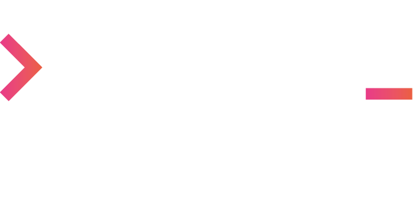
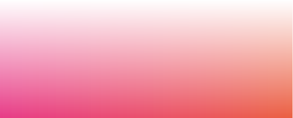

  <picture>
    <source media="(prefers-color-scheme: dark)" srcset="../images/logo-dark.png" />
    
  </picture>

---

  🚀 Software- en AI-bureau uit <strong>Buitenpost</strong>. 
  Waar de rest van de wereld zich verliest in visuele franje en marketinghype, focussen wij ons op de linkerhersenhelft: <strong>logica</strong>, <strong>back-end architectuur</strong> en <strong>meetbaar rendement</strong>.

  <a href="https://www.codewow.nl"><strong>💼 Bekijk vacatures op codewow.nl</strong></a>

---

## 🛠️ Onze Stack & Focus

  
  
  
  
  
  
  
  

- 🎯 **Laravel & TALL-stack**: Wij bouwen robuuste maatwerksoftware en complexe systemen met Laravel, Tailwind CSS, Alpine.js en Livewire. Voor admin-panels en dashboards gebruiken we FilamentPHP.
- 📝 **WordPress & CraftCMS**: Maatwerkthema's, plugins en functionaliteiten die verder gaan dan standaard installaties. Van custom post types tot complexe koppelingen.
- 🔗 **Integratie & AI**: Naadloze koppelingen met bestaande ICT-structuren en slimme AI-oplossingen.
- 📊 **Resultaatgericht**: Wij programmeren niet voor het plaatje, maar voor de prestatie van de organisatie.

  

## 👥 Werken bij CODE WOW!

Wij zoeken geen “flierefluiters”, maar programmeurs die houden van rust, inhoud en complexe puzzels.

- 🎯 **Inhoud boven franje**: Geen eindeloze brainstorms, maar technisch vakmanschap.
- 💰 **Goede arbeidsvoorwaarden**: Geen poespas!
- 🏆 **20 jaar ervaring**: De stabiliteit van een ervaren bureau (voorheen Creative Work) met de energie van een nieuwe koers.

  

## 💻 Wil jij bouwen aan systemen die er écht toe doen?

👉 **Bekijk onze vacatures op** [codewow.nl](https://www.codewow.nl)

  

